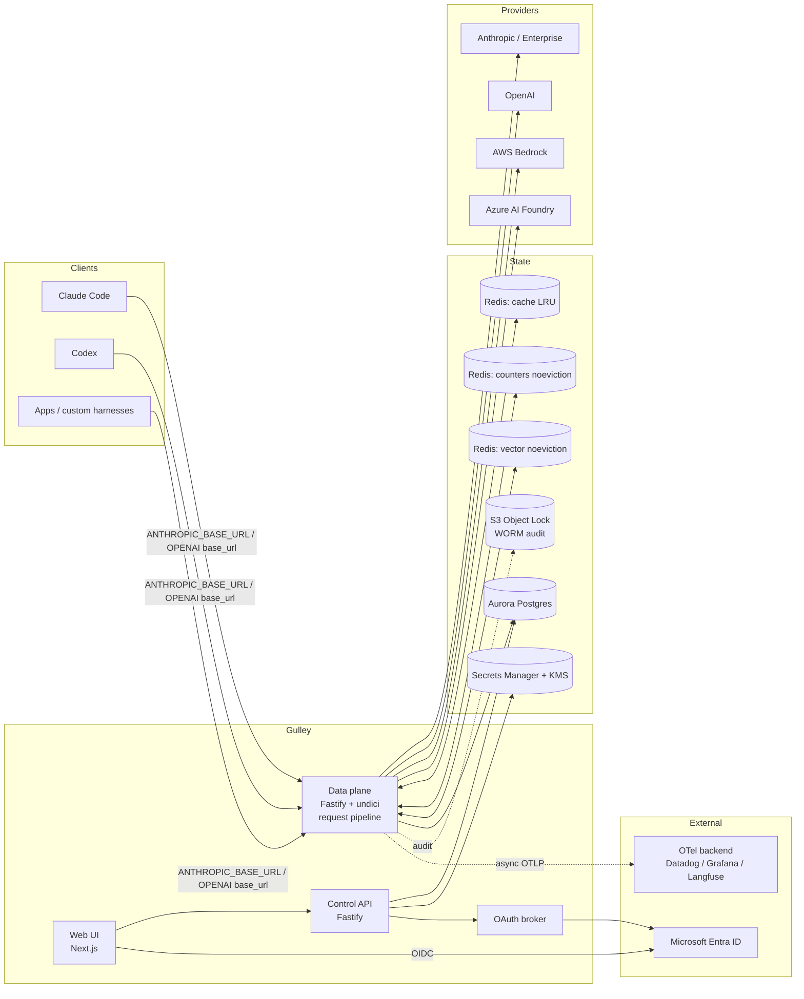
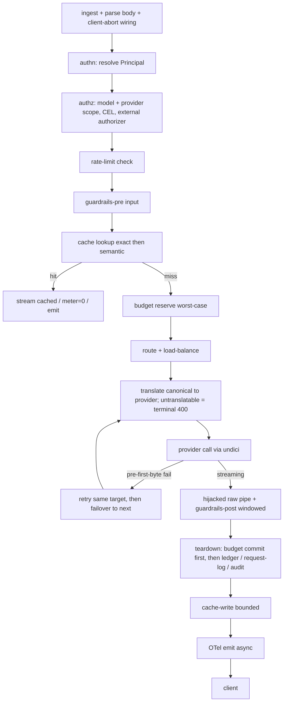

# Gulley — Architecture

> **Gulley** is a self-hostable, enterprise-grade **LLM Gateway**: a single container you run in AWS ECS that fronts every LLM provider your organization uses, adding routing, cost control, observability, caching, guardrails, access control, and audit — without changing a line of application code.

This document is the design source of truth; where it diverges from the shipped code, **`apps/gateway/src/routes/messages.ts` (`handleProxy`) is authoritative** for the request-pipeline order. See the [CHANGELOG](../CHANGELOG.md) for delivered capabilities. It folds in a competitor + provider-integration research pass and a four-lens adversarial architecture review (hot-path/streaming, auth/security, provider fidelity, data/ops).

---

## 1. Product thesis

No existing gateway nails all four of: broad provider coverage **+** genuinely clean architecture **+** enterprise governance **+** first-class coding-harness (Claude Code / Codex) support. LiteLLM has the breadth but a Python-monolith ceiling; Portkey has the cleanest edge-native TS architecture; Kong has enterprise policy but is heavyweight; Cloudflare/Vercel are minimal but thin on governance. Gulley's wedge is **all four at once**, with a **Claude-first** posture (Anthropic Messages schema as the canonical internal model) and **drop-in** compatibility so Claude Code, Codex, and custom harnesses "just work" by changing a base URL.

**Design values:** clean and minimal on the surface, deep underneath. Every feature is a composable stage in one request pipeline, not a bolted-on module.

---

## 2. Locked decisions

| Area                         | Decision                                                                                                                                                                                |
| ---------------------------- | --------------------------------------------------------------------------------------------------------------------------------------------------------------------------------------- |
| **Tenancy**                  | Single-tenant, self-hosted. One deployment = one org. `org_id`/`workspace_id`/`project_id` columns carried now for a future multi-tenant mode; no isolation machinery in v1.            |
| **Language**                 | TypeScript end-to-end.                                                                                                                                                                  |
| **Data plane**               | Node 22 + Fastify + undici, raw stream piping for SSE.                                                                                                                                  |
| **Control plane**            | Fastify API + Next.js (App Router) web UI.                                                                                                                                              |
| **Monorepo**                 | Turborepo + pnpm workspaces.                                                                                                                                                            |
| **Identity/SSO**             | Microsoft Entra ID (OIDC); group → role RBAC.                                                                                                                                           |
| **Harness/client auth**      | Three modes, per-(provider+route) policy: (a) gateway-brokered OAuth 2.0, (b) static virtual keys, (c) transparent upstream OAuth passthrough.                                          |
| **API surface**              | Native passthrough per provider at full fidelity **+** a normalized cross-provider layer; canonical internal model = **Anthropic Messages schema**.                                     |
| **v1 first-class endpoints** | Anthropic Messages, OpenAI Chat Completions, OpenAI Responses — all with SSE streaming. Embeddings used internally for semantic cache; passthrough for clients.                         |
| **Providers v1**             | OpenAI API, Anthropic API, Anthropic Enterprise, AWS Bedrock, Azure AI Foundry.                                                                                                         |
| **Observability**            | Real-time cost + budget caps enforced **locally** (Redis + Postgres). Deep telemetry emitted as **OpenTelemetry (GenAI semantic conventions)** to an external backend.                  |
| **Guardrails/PII**           | Native masking (regex + entity detection + secret scanning, reversible tokenization) default; optional per-route provider guardrail plugins (Bedrock Guardrails, Azure Content Safety). |
| **Caching**                  | Two-tier: exact-hash + semantic (embedding similarity).                                                                                                                                 |
| **Config**                   | Postgres source of truth via UI/API; serializable to versioned YAML for GitOps.                                                                                                         |
| **Secrets**                  | AWS Secrets Manager + KMS; Bedrock via ECS task-role + cross-account assume-role (no static keys).                                                                                      |
| **Compliance**               | SOC 2 Type II bar; seams (not full impl) for HIPAA / FedRAMP / EU residency.                                                                                                            |
| **Datastores**               | Aurora Postgres Serverless v2 + ElastiCache Redis (role-split, see §13).                                                                                                                |
| **Infra**                    | ECS Fargate, multi-AZ single region, ALB (SSE-tuned), autoscaling, ECR. Terraform, with a cheaper single-AZ dev workspace.                                                              |
| **CI/CD**                    | GitHub Actions **and** Azure DevOps pipelines at parity, both calling shared thin scripts.                                                                                              |

---

## 3. System overview

Two logically separate planes in one repo (deployable together or apart):

- **Data plane** (`apps/gateway`) — the stateless hot path. Terminates client requests, runs the pipeline, streams to/from providers. Scales horizontally on connection count + event-loop lag. Needs Redis (counters/cache/vector) and Postgres (config projection, audit sink); can run with a read replica of config for pure proxying.
- **Control plane** (`apps/control-api` + `apps/web`) — SSO'd admin API + UI. Manages orgs/workspaces, virtual keys, routes, policies, budgets, guardrails, config, and reads recent ops + audit. Owns the OAuth broker and config→YAML serialization.



---

## 4. The request pipeline

Every proxied request flows through one ordered, composable pipeline — `handleProxy()` in `apps/gateway/src/routes/messages.ts`. Each stage is a small, testable unit; routes enable/disable/configure stages via policy. **Ordering is fixed and documented** (avoids Kong-style plugin sprawl). The catalog is kept small and orthogonal, in the shipped order: **authn / authz (scope, CEL, external authorizer) / ratelimit / guard-in / cache / budget-reserve / route+failover (retry, hedge, cascade) / meter / emit** — note the cache lookup precedes budget reserve, so a cache hit is `$0` and never touches the budget. Model routing and request shaping (aliases, tenant overrides, smart routing, CEL transforms, spotlighting, stream-usage injection) run before the input guardrail, so what is scanned and cache-keyed is what is sent.



**Hot-path invariants (from the adversarial review — non-negotiable):**

- **Never accumulate a full response body by default.** On a streamed response, `guardrails-post` is a **windowed** scanner (`StreamingScanner`, audit-only, never mutates) plus the mask-vault detokenizer. In-stream enforcement is opt-in: `STREAMING_ENFORCE` runs a windowed rewriter that holds a bounded tail (`STREAMING_ENFORCE_WINDOW_CHARS`) and redacts / reversibly masks / blocks (a block is terminal) on Anthropic Messages, OpenAI `chat.completions` and Responses streams; a route's `holdStreamedOutput` buffers-then-flushes. Whole-document block/mask/redact otherwise applies to non-streamed (buffered) bodies.
- **Cap all buffering.** Buffered enforcement / non-streamed metering are capped at `RESPONSE_BUFFER_LIMIT_BYTES` (8 MiB; `BUFFER_FAIL_CLOSED` withholds an over-cap body, fail-open forwards it flagged unenforced); a cacheable miss over 2 MiB is streamed but never stored. Bytes pipe with `highWaterMark` backpressure — a full client socket pauses the upstream; that pause never trips the inactivity watchdog against the upstream, the same idle budget bounds the client's drain instead, and a reader that never drains is a client abort (partial spend metered, no breaker fault).
- **Full cancellation wiring.** `reply.raw` `'close'` is registered before the first `await` and every abort goes through one `abortWith(reason)` (`client | watchdog | deadline | transform | socket | guardrail`) that aborts the undici signal and destroys the live body. Only a client disconnect is recorded as `aborted`; every other reason is `error` with `abortReason` on the ledger, request log, audit row and span. Partial spend is metered from the last parsed usage. **One centralized `teardown()`** (stream `end`/`error`) is the only place budget commit/refund, ledger, request log, audit, cache store, mask-vault persist and telemetry happen — the reservation is released **first**, then each durable sink runs isolated (a failed ledger/audit write can't leak a reservation or skip the other sinks). Raw piping bypasses Fastify `onSend`/`onResponse`, and SOC 2 audit completeness depends on this.
- **Timeouts for long, gappy streams.** undici `bodyTimeout: 0` + `headersTimeout` = `UPSTREAM_HEADERS_TIMEOUT_MS` (default 10 min: a non-streamed long generation legitimately takes minutes). A headers timeout means the provider accepted and is probably billing the request, so it is **never retried, failed over or replayed** — hedge legs and cascade tier-1 included — it is one breaker fault, a 504, and the leg is metered at worst case. `REQUEST_DEADLINE_MS` bounds the whole pre-first-byte phase; `STREAM_INACTIVITY_MS` (120 s) is the post-first-byte watchdog; `HTTP_KEEPALIVE_TIMEOUT_MS` (310 s) exceeds the ALB idle timeout (300 s). Provider `: ping` comment lines pass through untouched.
- **Failover is pre-first-byte only, and in-band errors are failures.** Once bytes flow, a failure is a terminal error frame in the client's dialect, never a re-route. An `event: error` / `{"error":…}` frame under a 200 (native, translated, or a Bedrock `exception` eventstream frame, which is re-emitted as an Anthropic `event: error` followed by a clean end) is an error and a breaker fault; a terminal 4xx or an adapter refusal (`ProviderRequestError` → 400) is neither retried nor a fault. `Retry-After` is honoured but clamped (5 min).
- **CPU-heavy work stays bounded.** The native detectors are bounded, linear-time patterns run inline (no RE2 dependency; RE2 remains the documented seam for operator-supplied custom regexes), overlap resolution is O(n log n) with a fail-closed 10k-finding cap, and external plugins have a per-call deadline (`GUARDRAILS_PLUGIN_TIMEOUT_MS`). A worker-pool offload for NER-class detectors is a design seam, not shipped.

---

## 5. Provider abstraction & the canonical model

**Canonical internal representation = the Anthropic Messages schema** (richest superset: first-class `thinking`, typed `tool_use`/`tool_result` blocks, explicit `cache_control`, system blocks). Down-translation from canonical loses less than the reverse.

- **Native passthrough at full fidelity** — each provider gets its exact API surface under its own prefix (`/anthropic/v1/messages`, `/openai/v1/chat/completions`, `/openai/v1/responses`, `/openai/v1/embeddings`, `/bedrock/v1/messages`, `/azure/v1/chat/completions`, `/azure/v1/responses`); the shared `/v1/*` paths route by model. `/v1/models` lists what the principal may use.
- **Normalized layer** enables cross-provider routing/failover: translating adapters (`AnthropicToOpenAIAdapter`, `GeminiNativeAdapter`, Bedrock) accept the canonical schema and emit canonical SSE, so guardrails, cache, metering and audit see one shape. OpenAI-compatible presets (`CUSTOM_PROVIDERS`) cover hosted and local runtimes.

**Translation correctness (must-fix):**

- **Provider-affine artifacts are passthrough-preserved, never synthesized cross-provider:** Anthropic thinking `signature`/`redacted_thinking`, OpenAI Responses server-side state, `cache_control` breakpoints, raw tool-argument strings.
- **Pinning a conversation to its origin provider.** Shipped as session affinity: `LB_SESSION_AFFINITY_HEADER` pins a session (that header's value, else the principal) to one target by rendezvous hashing, which is what keeps signed thinking blocks and prompt-cache prefixes on the provider that produced them. An automatic "signed thinking block from X ⇒ refuse Y" preflight is a design target, not yet enforced.
- **Preflight = the adapter's translation check.** A request the target cannot carry (an unsupported surface such as `tools`/`thinking` on a lossy translation, a URL-sourced image for Gemini, an unsafe Bedrock model id) raises `ProviderRequestError` → a **terminal 400**: no same-target retry, no failover, no breaker fault. A general capability matrix with semantic-range normalization of sampling params remains a design target; today `temperature` passes through as sent, the OpenAI-chat translation refuses `tools`/`tool_choice`/`thinking`/`output_config`/`response_format` and any non-text block rather than dropping them, and `finish_reason` ↔ `stop_reason` is mapped explicitly.
- **Terminal (non-failover) classes:** adapter refusals (above), content-filter/refusals (Anthropic `stop_reason: refusal` is a 200 that is never cached), and any post-first-byte failure. Prevents failover storms. Context-window-exceeded / truncation / refusal on a cheap model can instead **escalate** through the buffered, pre-first-byte cascade (`CASCADE_POLICY`: tier-0 buffered, escalate to tier-1 on a configured `stop_reason`; both legs billed).
- **Bidirectional streaming state machine** with golden SSE fixtures (parallel tools, interleaved thinking, empty deltas, mid-stream error, `[DONE]` present/absent, usage timing). Correctly reassembles Anthropic `input_json_delta` vs OpenAI `tool_calls[].index` fragments; synthesizes/strips `[DONE]` per dialect.

**Routing** (`packages/routing`; Portkey-style strategy objects):

- `strategy { mode: single | loadbalance | fallback }` over `RouteTarget[]`. In env config mode each configured provider is a single-target strategy; `ROUTE_GROUPS` composes them into `fallback` / `loadbalance` routes, and the DB config document defines routes directly.
- `loadbalance` uses per-target `weight` and a `select` of `least-load` (power-of-two-choices, the default), `cheapest` (catalog price per target, with a per-provider `modelMap` for same-model arbitrage) or `fastest`; `LB_SESSION_AFFINITY_HEADER` switches the primary pick to rendezvous hashing. `fallback` triggers on `onStatusCodes` (default `408 409 429 500 502 503 504 529`; terminal 4xx never fail over) **plus the gateway-wide deadlines** (`UPSTREAM_HEADERS_TIMEOUT_MS`, `REQUEST_DEADLINE_MS`): a slow-loris still ends, but an accepted-then-silent request is never replayed.
- Conditional routing is delivered by composition rather than a `conditional` node: the model router (aliases, virtual models that override the strategy), per-tenant route overrides (`docs/MULTI_TENANCY.md`), smart routing (`SMART_ROUTING_ENABLED`, classifier → policy), CEL authorization/transforms and the budget-aware downshift.
- Fallback taxonomy: plain status-code failover; context-window / truncation / refusal escalation through the cascade; a content-policy fallback chain is not built.
- Resilience: circuit breaker per target (optionally shared across replicas via the counters Redis, `BREAKER_SHARED`; half-open admits one probe per replica), passive **outlier ejection** on EWMA time-to-headers (`OUTLIER_ENABLED`), an **adaptive concurrency limiter** fed time-to-first-byte (`ADAPTIVE_CONCURRENCY_ENABLED`; saturation is a load-shed with 503 + `Retry-After`, not a fault), bounded same-target retry (`RETRY_MAX_ATTEMPTS`) and pre-first-byte **hedging** (`HEDGE_DELAY_MS`).

---

## 6. Auth & identity

Client→gateway auth is resolved by a first-class **auth resolver**. **The single highest-severity rule:** the resolver **fails closed on the selected mode** and never falls through (virtual-key → passthrough fall-through is an open credential relay).

- **Mode is selected deterministically by credential channel**, never by trial: the `Basic` scheme, a JWT-shaped bearer, the `gko_at_` broker prefix and the `gk_` virtual-key prefix are mutually exclusive. A credential miss on the selected mode is a **generic 401**, never a downgrade; a credential-store outage is a 503 + `Retry-After`, never a 401.
- **Uniform Principal/Scope for every mode.** The `rbac` stage resolves a `Scope` (allowed providers/models, workspace budget, rate limits) for virtual keys, brokered tokens, IdP JWTs and Basic users alike; the deployment-wide model policy (`MODEL_ALLOW`/`MODEL_DENY`), CEL rules and the optional external authorizer apply on top. **Deny by default** when a mode yields no scope. Virtual keys must **not** inherit the route's upstream privilege.

**(a) Gateway-brokered OAuth 2.0** — device flow + auth-code/PKCE (S256 only; reject `plain`), consent bound to the signed-in admin, short-lived tokens. Harness side: the `gulley` CLI (`packages/cli`) runs the device flow and serves as Claude Code's `apiKeyHelper` / Codex's `auth` command (`docs/HARNESS_OAUTH.md`). Loopback-only redirect allowlist; device flow: 15-minute code TTL, per-IP rate limit on the `/oauth/*` surface, explicit consent naming client + workspace. Access and refresh tokens are stored only as **HMAC hashes under the key pepper**; refresh rotation with **reuse detection** (a replayed superseded token revokes the family and raises `oauth.refresh_reuse`); revoke on Entra deprovision (Graph `accountEnabled` checked at refresh).

**(b) Static virtual keys** (CI/service accounts) — HMAC-SHA256 with a **KMS-held pepper**, 256-bit secrets, constant-time compare, generic 401 (no prefix-vs-secret distinction). Expiry, disable and in-place rotate (epoch bump); last-used tracking (coalesced); **revocation takes effect on the next lookup** because the hot-path KeyStore reads Postgres per request on its own small pool (`DB_KEYSTORE_POOL_MAX`) — there is no TTL cache to wait out. Prefix+lookup for O(1) resolution.

**(c) Inbound IdP JWT and HTTP Basic** — a client's own Entra/OIDC JWT (`JWT_ISSUER` + `JWT_AUDIENCE`; scope from claims or the deny-by-default `JWT_GROUP_SCOPE_MAP`, `docs/ENTRA_SETUP.md`) and an htpasswd-backed Basic mode for legacy tooling.

**Transparent upstream OAuth passthrough** (Anthropic Enterprise tokens relayed as-is) is **not wired in the shipped gateway** — the principal kind is reserved. The constraints if it is ever enabled stand: only where Gulley is the sole egress path, metering/audit identity bound to the authenticated outer principal (never a client header), tokens memory-only, budgets documented as non-binding.

**Provider-side credentials:**

- **Bedrock** via ECS task-role → cross-account assume-role. Trust policy requires `ExternalId` + scoped principal ARN; caller passes a scoped session policy limiting model ARNs/regions; descriptive `RoleSessionName` for CloudTrail correlation.
- **On failover, rebuild the outbound request per provider:** fresh credential selection, provider-specific header set, re-run rbac/route-policy against the target, assert no source-provider auth header survives translation.
- **Secret references only** (Secrets Manager ARN + version) live in Postgres config, YAML exports, and audit diffs — never values. A serialization guard test fails the build if any secret-resolving field is emitted inline.

---

## 7. Cost metering & budgets

- **Meter only from raw provider `usage` objects**, never from canonical token fields. Per-provider cost functions encode inclusion semantics:
  - OpenAI: `prompt_tokens` **includes** `cached_tokens` (subset); include `reasoning_tokens` in billable output.
  - Anthropic: `input_tokens` **excludes** cache → true input = `input_tokens + cache_read_input_tokens + cache_creation_input_tokens`; do **not** add thinking tokens twice (already in `output_tokens`).
  - **Golden usage fixtures** per provider/model as regression tests. Local tokenization is labeled "estimate only," never source of truth.
- **Hard caps use reserve/commit.** Atomic Lua at admission (`packages/budget`, Redis `EVALSHA`; an in-memory store for single-node/dev): reserve the worst case (`input + max_tokens × output_price`), reject with 402 if `reserved + committed ≥ cap`; commit actual (refund the remainder) in teardown, keyed by request id. A live stream refreshes its reservation; an orphan is reclaimed after `BUDGET_RESERVATION_LIFETIME_MS`. Caps stack: workspace, per-model (`BUDGET_MODEL_CAPS`) and per-attribution (`BUDGET_ATTR_CAPS`, the runaway-agent control) must all admit. **Always meter partial spend** from aborted/failed-over attempts; an accepted-but-unanswered leg (headers timeout, hedge loser, cascade tier-1) is charged at worst case (`#hedge-timeout` / `#cascade-tier1` ledger rows).
- **A counter-store outage degrades loudly, not silently.** `BUDGET_FAIL_OPEN` (default true) serves without a reservation and records a `budget.store_unavailable` audit row, a log line and `gulley_store_errors_total`; `false` refuses with 503 + `Retry-After`. Rate-limit and cache-lookup outages follow the same log + audit + metric pattern.
- **Postgres ledger is the durable source of truth; Redis counters are a rebuildable projection** (never the reverse). A counter-cluster failover that resets short-TTL counters self-heals from the ledger.
- **Inject `stream_options.include_usage: true`** on OpenAI-wire chat streams (`METER_INJECT_STREAM_USAGE`, default on); the one extra spec-compliant final usage chunk is forwarded to the client. A 2xx with no usage bills $0 unless `METER_CHARGE_ON_MISSING_USAGE`; an off-catalog model is observed (`gulley_unpriced_requests_total`) and charged worst-case only with `METER_FAIL_CLOSED_ON_UNPRICED`. Use Anthropic `message_start`/`message_delta` usage and Responses `response.completed` usage.

---

## 8. Caching

Two tiers, both **partitioned by authz scope** — every exact + semantic key is namespaced by principal (or role/policy-group) + route + model + capability fingerprint + relevant beta headers. **PII/secret-flagged responses are excluded from cache.** (Fuzzy semantic match makes cross-principal leakage worse, hence strict partitioning.)

- **Exact tier** — hash of the canonicalized request (volatile fields stripped); cheap and safe on the hot path; on with `CACHE_ENABLED` (`CACHE_EXACT_BACKEND`: postgres | redis | memory).
- **Semantic tier** — embedding-similarity, **explicit opt-in** (`CACHE_SEMANTIC_ENABLED`, `CACHE_SIMILARITY_THRESHOLD`; LiteLLM's own multi-turn/agentic caution); OpenAI-compatible embeddings provider (`EMBEDDINGS_*`); **pgvector is the default index** (`CACHE_VECTOR_BACKEND`: pgvector | redis | memory), see [Open Decisions](#16-open-decisions).
- **Per-request cache-control**: `Cache-Control: no-cache` skips the lookup, `no-store` skips the write. Every response carries `x-gulley-cache: hit | miss | bypass | error`; a hit also carries `cache-status: Gulley; hit`.
- **Never cached:** sensitive output (PII/secret findings, or a scan that failed), a withheld or guardrail-blocked body, a refusal, a tool-call-governed response, a cascade-escalated or budget-downshifted answer (the key belongs to the original model), and anything over the 2 MiB write cap.
- **Failure semantics:** cache + vector + semantic-lookup **fail-open** (bypass to provider, bounded by `CACHE_LOOKUP_TIMEOUT_MS`, recorded as `x-gulley-cache: error` + `gulley_store_errors_total`).

---

## 9. Guardrails & data masking

- **Native default fast path** (`packages/guardrails`): deterministic detectors — bounded regex + secret-scan prefixes + Shannon-entropy catch-all, Luhn-validated cards, an opt-in prompt-injection/jailbreak detector (`GUARDRAILS_INJECTION_ENABLED`) — with overlap resolution so each span has one winning finding. The input scan runs over the decoded JSON text, so escape tricks can't evade it. ML/NER detectors are a seam.
- **Policies per direction:** `GUARDRAILS_INPUT_ACTION` / `GUARDRAILS_OUTPUT_ACTION` = `audit` (default, record only) | `block` | `mask` (reversible tokenization to the provider, detokenized on the way back) | `redact`, each with a confidence floor. A plugin's `blocked`/`masked` verdict is authoritative even under the audit default and composes with the native transform.
- **Streaming:** windowed incremental scan (see §4). Whole-document enforcement applies to buffered bodies (non-streamed, or a route's `holdStreamedOutput`). **Scope of the windowed in-stream enforcer (`STREAMING_ENFORCE`):** it rewrites the _text_ deltas of a stream (Anthropic `text_delta`, OpenAI `content` / Responses `output_text`); `thinking`, `input_json_delta` / tool-call argument fragments and other non-text frames pass through unchanged and are covered by the audit-only scan, not redacted in-stream. A policy that must enforce over tool arguments or reasoning uses the buffered mode; tool-call **intent** is governed separately by `TOOL_POLICY` (CEL over each requested tool call, buffered, fail-closed).
- **Indirect-injection spotlighting** (`GUARDRAILS_SPOTLIGHT`): untrusted spans (Anthropic `tool_result`, OpenAI `role: tool`) are wrapped in trust-tag delimiters, deterministic and cache-safe.
- **Provider plugins** (composed with the native detectors): Bedrock Guardrails (`ApplyGuardrail`), Azure AI Content Safety, OpenAI Moderation, Google Model Armor and a bring-your-own DLP webhook. All are DLP/moderation _enforcement_, so they **fail closed by default** (`GUARDRAILS_*_FAIL_CLOSED`), share `GUARDRAILS_PLUGIN_TIMEOUT_MS`, never follow redirects and egress through a DNS-pinned agent; degradation is metered.
- **Reversible-tokenization vault** is treated as PHI-grade: tokens are nonce'd per vault (`<<GULLEY_EMAIL_9994E22F_1>>`) so a masked value from an earlier turn can never be confused with this turn's, **per-request scope (never global)**, and detokenized only within the same request. Persisting the reversal map is opt-in (`MASK_VAULT_PERSIST`): KMS envelope-encrypted (`GULLEY_KMS_KEY_ARN`, required in production), bounded TTL with an expiry sweep, revealed only through the audited control-plane `GET /admin/mask-vault/:requestId`, and erasable per subject by BYOK crypto-shred (`CRYPTO_SHRED_ENABLED`).
- **Governance is free, not metered** — allow/deny lists, budgets, ZDR are core primitives, not upsells.

---

## 10. Observability

- **OTel GenAI semantic conventions**, one CLIENT-kind span per call, span name `{gen_ai.operation.name} {gen_ai.request.model}`; propagate W3C `traceparent`. Emit both `gen_ai.provider.name` and legacy `gen_ai.system`.
- **Usage attributes follow the inclusive-total contract** (see appendix), with cache/reasoning breakdowns.
- **Content is opt-in (default OFF)**; the old `gen_ai.prompt`/`gen_ai.completion` model is deprecated.
- **Export is strictly async** via a bounded batch processor that drops rather than back-pressures the proxy; export failures are counted (`gulley_otel_export_failures_total`). Sampling is head-based (`TRACE_SAMPLE_RATIO` for freshly started traces; an inbound sampled flag is always honoured, `TRACE_PROPAGATION`); tail-sampling is not built. Reduced metric-label cardinality (virtual-key on logs/exemplars, not metric labels).
- **Prometheus `/metrics` on a separate management listener** (`METRICS_PORT`, default 9090, never the data port): requests/tokens/cost, cache events, budget utilization, breaker state changes, failovers/hedges, aborts by reason, shed reasons, store and sink errors, and `gulley_build_info` (version + sha labels). The control plane scrapes it for the console's Observability page (`GATEWAY_METRICS_URL`).
- **When the OTel backend is down, the proxy is unaffected** and budgets still enforce (they're local).

---

## 11. Config & GitOps

- **One authoritative direction: DB-authoritative with read-only YAML export** (the default), or git-authoritative with UI-opens-PRs (alternative). Never bi-directional auto-sync.
- Monotonic **config version + optimistic concurrency** (reject apply if base ≠ current); deterministic/canonical serialization (stable key order); **plan/dry-run diff**; a **drift-detection job that reports (never auto-heals)**.
- **YAML apply flows through the same audit-emitting, RBAC-enforcing path as UI/API writes.**

---

## 12. Security & compliance (SOC 2 Type II bar)

- **Audit = tamper-evident.** Hash-chain each row (`row_hash = H(prev_hash ‖ canonical(payload))`) + periodic chain verification; revoke `UPDATE`/`DELETE` from the app role + a trigger that raises on modification. **Ship the audit stream to S3 Object Lock (COMPLIANCE mode)** as the retained WORM system of record; Postgres is the queryable projection. **Raw PII stays out of WORM** (GDPR erasure) — only non-PII metadata.
- **SSRF lockdown** (`packages/egress`). Guarded egress (DLP plugins, the external authorizer, webhooks, request mirrors, OIDC discovery/JWKS/token, the SIEM and anchor sinks, config-apply provider URLs) never follows redirects, resolves through a **DNS-pinned undici agent** (no rebind between check and connect), and blocks localhost, link-local/metadata (`169.254.0.0/16`, `169.254.170.2`) and RFC1918 unless the specific `*_ALLOW_INTERNAL` bypass is set; `OUTBOUND_HOST_ALLOWLIST` is the explicit host allowlist and `AIR_GAPPED` makes an empty allowlist deny everything (SDK egress — S3 for WORM, KMS — bypasses the fetch guard; use VPC endpoints). Provider/embedding endpoints are **server-side config only** (no client base-URL or egress-steering headers); `gulley doctor` flags a provider still pointed at its public endpoint under `AIR_GAPPED`.
- **Credential hygiene to telemetry.** Allowlist-based attribute emission (never auto-capture headers); provider-aware sensitive-header denylist (`Authorization`, `x-api-key`, `api-key`, `cookie`, AWS SigV4). **No-credential-logging is always-on and independent of the no-content toggle**; tests assert no credential material in any exported span across the auth modes.
- **"No-content" is a global mode gated at every sink** (local log, OTel exporter, cache). In that mode, semantic cache is disabled or stores only salted hashes + encrypted payloads with bounded TTL.
- **Split KMS keys per secret class.** Encryption in transit + at rest everywhere.
- **Compliance seams (not full v1 impl):** HIPAA (BAA mode, PHI masking, no-content), FedRAMP (region pin, FIPS endpoints), EU residency (region pinning, geo-only inference).

---

## 13. Data model & datastores

**Aurora Postgres Serverless v2** — config/metadata/audit + bounded recent-ops:

- Core: `org`, `workspace`, `project`; admin identity: `admin_user`, `membership` (RBAC grants), `admin_session`, `scim_group`, `scim_group_member`.
- Access: `virtual_key` (hashed secret, scope, expiry, last_used, epoch), `oauth_client`, `oauth_grant`, `device_code`, `auth_code`.
- Routing/policy: `provider`, `provider_credential` (secret ARN ref), `model_alias`, `route`, `route_policy`, `smart_routing_policy`, `budget`, `rate_limit`, `guardrail`; `prompt_template` / `prompt_version` (hash-chained prompt registry).
- Ledger/audit: `spend_ledger` (durable truth), `audit_log` (hash-chained, append-only by trigger + revoked `UPDATE`/`DELETE`), `config_version`.
- Cache/vault: `cache_entry`, `semantic_vector` (pgvector), `classifier_centroid`, `mask_vault`, `subject_key` (BYOK per-subject keys).
- **Recent ops** (`request_log`) — high write volume; write path isolated from control-plane transactions. (They dropped ClickHouse, so this telemetry lands on Postgres and must be bounded.) **Retention today:** a bounded, batched DELETE sweep on `created_at` behind `REQUEST_LOG_RETENTION_DAYS` (off = keep forever), run off the hot path on an unref'd timer — mirroring the exact-cache and mask-vault expiry sweeps. Declarative time-partitioning with pg_partman partition-drop retention + per-minute rollups is the planned evolution (not yet delivered); `spend_ledger` (the durable budget/chargeback source of truth) is never swept.

**ElastiCache Redis — split by role onto separate clusters/node-groups** (a single eviction policy can't serve all three):

1. **Cache** — `allkeys-lru`.
2. **Counters** (rate-limit + budget) — `noeviction`, explicit TTLs, multi-AZ auto-failover, re-derivable from the Postgres ledger.
3. **Vector index** (semantic cache) — `noeviction`, isolated so KNN can't head-of-line the counter ops. (See [Open Decisions](#16-open-decisions) for Redis-vs-pgvector.)

---

## 14. Infrastructure & deployment

- **ECS Fargate, multi-AZ single region, behind an ALB** (HTTP/1.1 end-to-end on the SSE path). Terraform IaC; a cheaper single-AZ **dev** workspace.
- **ALB tuned for SSE:** `idle_timeout.timeout_seconds` ≥ 300 (default 60 kills streams); target-group `deregistration_delay` ~120–300s; fast SIGTERM drain so deploys/AZ events don't cut streams.
- **Fargate:** `stopTimeout` 120 s with `SHUTDOWN_GRACE_MS` (110 s) strictly inside it, so the bounded SIGTERM drain finishes before SIGKILL; client reconnect (`Last-Event-ID`) + idempotent retries so post-cut retries don't double-charge. **Autoscaling** is on ALB request count per target (`ALBRequestCountPerTarget`) as the connection-load proxy; active-connection / event-loop-lag scaling is a design target. **Readiness:** `/ready` is 503 until a working gateway context is wired (health-only boot on incomplete config) and, in DB mode, until the database schema matches the migrations the build ships (`DB_SCHEMA_CHECK`).
- **Aurora Serverless v2:** `serverlessv2_scaling_configuration { min, max }` (`min_acu`/`max_acu`); note RDS Proxy blocks scale-to-zero.
- **VPC interface endpoints** for `bedrock-runtime`, `secretsmanager`, `kms`, `ecr`, `logs`, `sts` + an S3 gateway endpoint (keeps traffic off the public internet, complements SSRF lockdown).
- **Terraform:** one adaptable root module in `infra/terraform` (`network.tf`, `security.tf`, `data.tf`, `compute.tf`, `edge.tf`, `observability.tf`); a `tier` preset (`test` = single-AZ/1 NAT/shared Redis/Spot, `prod` = 3 AZ/NAT per AZ/Aurora multi-AZ/Redis×3/WORM/deletion protection) plus per-knob overrides, environments as `.tfvars`; `INSTALL.md` is the ordered runbook. `infra/eks` is the sibling root for EKS + the cloud-agnostic Helm chart (`deploy/helm/gulley`, chart 0.2.0); `deploy/docker-compose.prod.yml` is the one-command self-host.

### Runtime image

One distroless image (`gcr.io/distroless/nodejs22-debian12:nonroot`; `node` is the
entrypoint, no shell or package manager) runs either plane. `scripts/bundle.mjs`
(esbuild) bundles every `@gulley/*` package into `dist/gateway/main.mjs`,
`dist/gateway/doctor.mjs`, `dist/control-api/main.mjs`, `dist/control-api/migrate.mjs`
and `dist/control-api/audit-verify.mjs`, stamps the version/sha (build args
`GULLEY_VERSION` / `GULLEY_BUILD_SHA` → `GULLEY_BUILD` in `packages/core`, surfaced on
`/health`, `gulley_build_info` and OTel `service.version`), and copies the migrations
(`GULLEY_MIGRATIONS_DIR`); third-party packages are installed production-only per app
(`pnpm deploy`) next to each entry — no tsx, esbuild, vitest or drizzle-kit at runtime.
Every deployment (compose, Helm, ECS) runs the same entries and probes through node in
exec form; migrations run from the image (`migrate.mjs`) and `/ready` compares the
database's applied set with the bundled journal (`packages/storage/src/schema-status.ts`).

---

## 15. Repository structure

```
gulley/
├─ apps/
│  ├─ gateway/          # data plane: Fastify + undici proxy, the pipeline (routes/messages.ts)
│  ├─ control-api/      # control plane API: admin CRUD, config/GitOps, OAuth broker, OIDC, SCIM, compliance
│  └─ web/              # Next.js (App Router) + Tailwind admin console (+ Playwright e2e)
├─ packages/
│  ├─ core/             # ids, SecretRef, Result, build version — the shared base
│  ├─ providers/        # adapters (anthropic, openai, bedrock, azure, gemini), SSE state machine + rewriters, translation
│  ├─ routing/          # strategies, selection, circuit breaker, outlier, adaptive limiter, model + smart routers
│  ├─ auth/             # virtual-key resolver (HMAC + pepper), Basic auth, admin sessions
│  ├─ oauth/            # gateway-brokered OAuth (device + PKCE, refresh-reuse detection)
│  ├─ oidc/             # OIDC discovery/JWKS/JWT verify (console SSO, inbound JWT)
│  ├─ rbac/             # deny-by-default roles + Scope
│  ├─ budget/ ratelimit/ cost/ catalog/   # reserve/commit, RPM/TPM windows, cost fns + golden fixtures, price catalog
│  ├─ cache/            # exact + semantic tiers, scope-partitioned keys
│  ├─ guardrails/       # native detectors, injection, spotlighting, tokenization vault, plugins, streaming
│  ├─ cel/              # CEL evaluator for authz / transforms / tool policy
│  ├─ pipeline/         # hash-chained audit sink, sanitize/redaction ports, batching, attestation
│  ├─ config/           # canonical DB↔YAML, versioning, plan/diff, drift
│  ├─ prompts/          # hash-chained prompt registry + renderer
│  ├─ storage/          # Drizzle schema + migrations, Postgres adapters, role-split Redis, pub/sub, schema status
│  ├─ telemetry/ metrics/ redact/ egress/ crypto/ worm/ http-edge/   # OTel + access log, Prometheus, no-content, SSRF guard, split-KMS envelope, S3 Object Lock, CORS/CSRF/headers
│  ├─ cli/              # `gulley` developer CLI (login/token/logout/status, signed onboarding packs)
│  └─ control-client/   # typed control-plane client + OpenAPI document
├─ deploy/              # docker-compose self-host, Helm chart, manifest validator
├─ infra/terraform/     # single adaptable ECS module (test/prod tiers) + INSTALL.md
├─ infra/eks/           # EKS root module for the Helm chart
├─ scripts/bundle.mjs   # esbuild bundling for the distroless runtime image
├─ ci/                  # shared verify/build/scan scripts (called by both CIs)
├─ .github/workflows/   # GitHub Actions (thin, call ci/)
├─ .azuredevops/        # Azure Pipelines (thin, call ci/)
└─ docs/                # this doc, ROADMAP.md, runbooks, docs/openapi/control-api.json
```

**Baseline stack details:** Drizzle ORM + SQL migrations; Zod validation (env config, API); Vitest (unit/integration) + Playwright (console e2e); multi-stage distroless container, non-root, Node as PID 1; pnpm + Turborepo task graph; no build step for libraries (apps import TS source, bundled only for the image).

---

## 16. Open decisions

All resolved. Recorded here as the decision log.

1. **Product name & package namespace** — ✅ **Gulley** / `@gulley/*` (rename later is a mechanical sweep).
2. **Licensing** — ✅ **Apache-2.0** (OSS). License headers + `NOTICE` + `CONTRIBUTING.md` with **DCO** (`Signed-off-by`); public-by-default posture → strict secret hygiene (ARNs only in-tree). Dependency bumps stay manual (`workflow_dispatch`-only grouped PR).
3. **OpenAI Responses state ownership** — ✅ **client-owned by default** (`previous_response_id` → provider-pinned, failover-ineligible), **gateway-owned local turn store as a per-route opt-in** (`store:false`, routable/portable).
4. **Personal subscription tokens (Claude Max / ChatGPT Plus)** — ✅ **excluded from v1.** Passthrough is Anthropic Enterprise + org-managed credentials only.
5. **Streaming guardrails-post default** — ✅ windowed incremental scan, with per-route `buffered` opt-in.
6. **Hard budget on streaming** — ✅ reserve/commit for `hard` budgets (reject early on worst-case), `soft` budgets tolerate bounded overshoot; configurable per budget.
7. **Vector index location** — ✅ decided as a dedicated `noeviction` Redis vector node-group with pgvector as the alternative; **shipped the other way round**: pgvector-in-Postgres is the default (`CACHE_VECTOR_BACKEND=pgvector`, migration 0003), Redis Stack is the adapter alternative, and the third Redis role is still provisioned for it.
8. **Fargate task shape** — ✅ presets ship at 0.5 vCPU / 1 GB (`test`) and 1 vCPU / 2 GB (`prod`), overridable per plane (`cpu`/`memory`, `control_*`, `web_*`); the original 4 vCPU / 8 GB target was sized for a worker-pool offload that is not built.
9. **Global cross-region inference** (`global.` prefix) — ✅ configurable, region-scoped (`us.`) by default.
10. **First provider taken fully end-to-end** — ✅ Anthropic Messages + Claude Code, then fan out.

---

## Appendix A — Concrete integration specs

_Model IDs, pricing, and API versions drift — fetch live where noted and pin semconv/api versions. This appendix is the "hard-code the right thing" reference._

### Anthropic (canonical + passthrough)

- `POST https://api.anthropic.com/v1/messages`; passthrough `/v1/messages/count_tokens`, `/v1/messages/batches`, `/v1/files`, `/v1/models`.
- Headers: `x-api-key`, `anthropic-version: 2023-06-01`, `content-type: application/json`; optional `anthropic-beta`.
- OAuth: `Authorization: Bearer <token>` **plus** `anthropic-beta: oauth-2025-04-20`; do **not** also send `x-api-key` (mutually exclusive).
- SSE order: `message_start` → (`content_block_start` → `content_block_delta`* → `content_block_stop`)* → `message_delta` → `message_stop`; plus `ping` + mid-stream `error`. **No `[DONE]`.**
- `content_block_delta.delta.type`: `text_delta`, `thinking_delta`, `signature_delta`, `input_json_delta` (accumulate `partial_json`, parse once at `content_block_stop`), `citations_delta`.
- `stop_reason`: `end_turn | max_tokens | stop_sequence | tool_use | pause_turn | refusal | model_context_window_exceeded`. **`refusal` is HTTP 200 with empty/partial content — not a success to cache/failover.**
- Usage: `input_tokens` (uncached remainder), `output_tokens`, `cache_creation_input_tokens` (~1.25× @5m / 2× @1h), `cache_read_input_tokens` (~0.1×). Streaming: input/cache in `message_start.usage`; final `output_tokens` in `message_delta.usage`.
- `cache_control`: `{"type":"ephemeral"}` or `{...,"ttl":"1h"}`; max 4 breakpoints, 20-block lookback; render order tools → system → messages.
- thinking: `{"type":"adaptive","display":"summarized|omitted"}`, effort via `output_config.effort: low|medium|high|xhigh|max`. Legacy `{"type":"enabled","budget_tokens":N}` 400s on newer models. Thinking blocks echoed back unchanged in multi-turn on the same model.
- Admin: `GET /v1/organizations/usage_report/messages` (`bucket_width 1m|1h|1d`), `GET /v1/organizations/cost_report` (1d only, USD cents as decimal strings). Admin key prefix `sk-ant-admin01-`; ~5-min lag, poll ≤ 1/min; cursor pagination (`has_more`/`next_page`).
- Model catalog: fetch live from `GET /v1/models` on a TTL — **do not hardcode IDs.** Current-era (verify live): `claude-opus-4-8`, `claude-sonnet-5`, `claude-haiku-4-5`.

### Claude Code / harness hookup

- Behind `ANTHROPIC_BASE_URL`. `ANTHROPIC_AUTH_TOKEN` → `Authorization: Bearer`; `ANTHROPIC_API_KEY` → `x-api-key`. Precedence: Bedrock/Vertex/Foundry env → `ANTHROPIC_AUTH_TOKEN` → `ANTHROPIC_API_KEY` → `apiKeyHelper` → `CLAUDE_CODE_OAUTH_TOKEN` → subscription OAuth.

### OpenAI Chat + Responses

- `POST /v1/chat/completions` (SSE `chat.completion.chunk`, `choices[].delta`, `tool_calls[].index` correlation, terminated by literal `data: [DONE]`); `stream_options:{include_usage:true}` for a final usage frame.
- `POST /v1/responses` (+ `GET/DELETE /v1/responses/{id}`, `GET /v1/responses/{id}/input_items`). Fields: `input`, `instructions`, `max_output_tokens`, `store`, `previous_response_id`, `reasoning:{effort,summary}`, `text:{format,verbosity}`. Usage: `input_tokens`/`output_tokens` (+ `output_tokens_details.reasoning_tokens`).
- Responses SSE: `response.created`, `response.in_progress`, `response.output_item.added`, `response.content_part.added`, `response.output_text.delta` (`{item_id,output_index,content_index,delta,sequence_number}`), `.done` variants, `response.function_call_arguments.delta/.done`, `response.reasoning_summary_text.delta`, `response.completed` (full final object), `error`. Forward verbatim; preserve `sequence_number`.
- Codex: `~/.codex/config.toml` `[model_providers.<id>]` `base_url` (ends `/v1`), `wire_api="responses"`, `env_key=<GATEWAY_TOKEN_VAR>` (sent as `Authorization: Bearer`); honor `stream_idle_timeout_ms` (default 300000).

### Azure AI Foundry

- v1: `POST https://{resource}.openai.azure.com/openai/v1/responses` (no api-version; deployment name in body `model`). Legacy: `.../openai/deployments/{deployment}/responses?api-version=2025-04-01-preview`.
- Auth: key → `api-key: {key}` (**not** `Authorization`); Entra → `Authorization: Bearer`, scope `https://ai.azure.com/.default` (alt `https://cognitiveservices.azure.com/.default`). Gateway converts Codex's Bearer → Azure `api-key`/Entra.

### AWS Bedrock

- Host `bedrock-runtime.{region}.amazonaws.com`. Claude default: `POST /model/{modelId}/invoke-with-response-stream` with native Anthropic body (preserves `anthropic_version`, `top_k`, thinking, `cache_control`). Reserve `POST /model/{modelId}/converse-stream` for multi-vendor abstraction (`messageStart`/`contentBlockDelta`/… members).
- Response is `application/vnd.amazon.eventstream` (SigV4-framed) — **decode server-side, re-emit as `text/event-stream`;** never pipe straight to a browser.
- IAM: Converse/InvokeModel → `bedrock:InvokeModel`; streaming → `bedrock:InvokeModelWithResponseStream`.
- Newer Claude models need a **region-prefixed inference-profile ID** (`us.`/`eu.`/`apac.`/`global.`), e.g. `us.anthropic.claude-sonnet-4-5-20250929-v1:0`. CRIS IAM must grant on **both** the inference-profile ARN (caller region) **and** the `foundation-model` ARN (every destination region). Load IDs from config; `-v1:0` suffix convention is inconsistent across generations.

### Guardrails / PII services

- **Presidio:** analyzer `POST /analyze` (:5002); anonymizer `POST /anonymize` + `POST /deanonymize` (:5001); operators `replace|redact|mask|hash|encrypt|keep|custom`; `encrypt` = AES-CBC (key 16/24/32 B), reversible via DeanonymizeEngine.
- **Bedrock Guardrails:** `POST /guardrail/{id}/version/{v}/apply` (`source=INPUT|OUTPUT`); response `action=NONE|GUARDRAIL_INTERVENED`; streaming `amazon-bedrock-guardrailConfig.streamProcessingMode = SYNCHRONOUS|ASYNCHRONOUS`; per-PII `BLOCK|ANONYMIZE` (ANONYMIZE not reversible).
- **Azure:** Prompt Shields `POST {ep}/contentsafety/text:shieldPrompt?api-version=2024-09-01`; moderation `text:analyze` (severity 0–7); PII via Azure AI **Language** `POST {ep}/language/:analyze-text?api-version=2024-11-01` `kind=PiiEntityRecognition`. Auth `Ocp-Apim-Subscription-Key` or Entra Bearer.
- **Secret-scan prefixes:** AWS `AKIA/ASIA`, GitHub `ghp_/gho_/ghs_`, OpenAI `sk-`, Slack `xoxb-/xoxp-`, Google `AIza`, PEM `-----BEGIN * PRIVATE KEY-----`, JWT `eyJ`; entropy fallback base64 > ~4.5, hex > ~3.0.

### OTel GenAI attributes

- Span name `{gen_ai.operation.name} {gen_ai.request.model}`; one CLIENT span/call; accept W3C `traceparent`.
- `gen_ai.operation.name`: `chat|text_completion|embeddings|generate_content|execute_tool|create_agent|invoke_agent|retrieval`.
- `gen_ai.provider.name`: `openai|anthropic|aws.bedrock|azure.ai.openai|gcp.vertex_ai|gcp.gemini` — **also emit `gen_ai.system`** for back-compat.
- `gen_ai.request.model`, `gen_ai.response.model`, `gen_ai.response.id`, `gen_ai.response.finish_reasons[]`.
- Usage (inclusive-total): `gen_ai.usage.input_tokens` = uncached + cache_read + cache_creation; breakdown `gen_ai.usage.cache_read.input_tokens`, `gen_ai.usage.cache_creation.input_tokens`, `gen_ai.usage.reasoning.output_tokens`; `gen_ai.usage.output_tokens`.
- Content **opt-in (default OFF)**: `gen_ai.input.messages`, `gen_ai.output.messages`, `gen_ai.system_instructions` (JSON). `gen_ai.prompt`/`gen_ai.completion` deprecated.
- Metrics: `gen_ai.client.operation.duration` (s), `gen_ai.client.token.usage` (dim `gen_ai.token.type=input|output`), `gen_ai.server.time_to_first_token`, `gen_ai.server.time_per_output_token`; plus `server.address`, `server.port`, `error.type`. **Pin the semconv version.**
- Langfuse OTLP (if targeted): `POST /api/public/otel/v1/traces`, `Authorization: Basic base64(pk-lf-…:sk-lf-…)`, `x-langfuse-ingestion-version: 4`; cost via `langfuse.observation.cost_details.total_cost`.

### Infra tuning constants

- ALB `idle_timeout` ≥ 300s (default 60); `deregistration_delay` ~120–300s; Fargate `stopTimeout` max 120s; Aurora Serverless v2 `db.serverless` + `serverlessv2_scaling_configuration{min,max}` (0.5-ACU steps); VPC interface endpoints for bedrock-runtime/secretsmanager/kms/ecr/logs.
