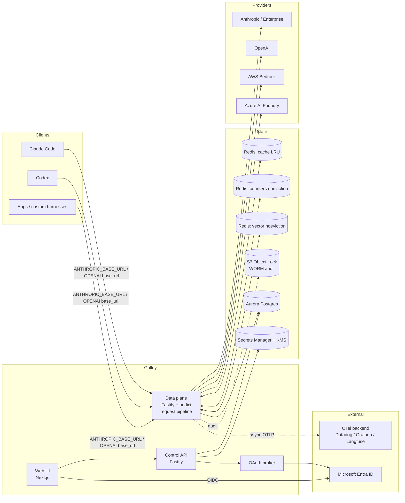
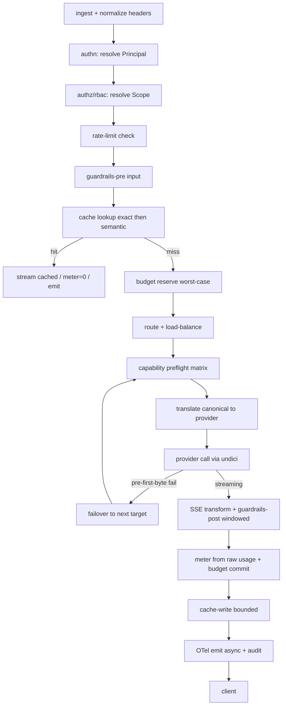

# Gulley — Architecture

> **Gulley** is a self-hostable, enterprise-grade **LLM Gateway**: a single container you run in AWS ECS that fronts every LLM provider your organization uses, adding routing, cost control, observability, caching, guardrails, access control, and audit — without changing a line of application code.

This document is the design source of truth; where it diverges from the shipped code, **`apps/gateway/src/routes/messages.ts` (`handleProxy`) is authoritative** for the request-pipeline order. See the [CHANGELOG](../CHANGELOG.md) for delivered capabilities. It folds in a competitor + provider-integration research pass and a four-lens adversarial architecture review (hot-path/streaming, auth/security, provider fidelity, data/ops).

---

## 1. Product thesis

No existing gateway nails all four of: broad provider coverage **+** genuinely clean architecture **+** enterprise governance **+** first-class coding-harness (Claude Code / Codex) support. LiteLLM has the breadth but a Python-monolith ceiling; Portkey has the cleanest edge-native TS architecture; Kong has enterprise policy but is heavyweight; Cloudflare/Vercel are minimal but thin on governance. Gulley's wedge is **all four at once**, with a **Claude-first** posture (Anthropic Messages schema as the canonical internal model) and **drop-in** compatibility so Claude Code, Codex, and custom harnesses "just work" by changing a base URL.

**Design values:** clean and minimal on the surface, deep underneath. Every feature is a composable stage in one request pipeline, not a bolted-on module.

---

## 2. Locked decisions

| Area                         | Decision                                                                                                                                                                                |
| ---------------------------- | --------------------------------------------------------------------------------------------------------------------------------------------------------------------------------------- |
| **Tenancy**                  | Single-tenant, self-hosted. One deployment = one org. `org_id`/`workspace_id`/`project_id` columns carried now for a future multi-tenant mode; no isolation machinery in v1.            |
| **Language**                 | TypeScript end-to-end.                                                                                                                                                                  |
| **Data plane**               | Node 22 + Fastify + undici, raw stream piping for SSE.                                                                                                                                  |
| **Control plane**            | Fastify API + Next.js (App Router) web UI.                                                                                                                                              |
| **Monorepo**                 | Turborepo + pnpm workspaces.                                                                                                                                                            |
| **Identity/SSO**             | Microsoft Entra ID (OIDC); group → role RBAC.                                                                                                                                           |
| **Harness/client auth**      | Three modes, per-(provider+route) policy: (a) gateway-brokered OAuth 2.0, (b) static virtual keys, (c) transparent upstream OAuth passthrough.                                          |
| **API surface**              | Native passthrough per provider at full fidelity **+** a normalized cross-provider layer; canonical internal model = **Anthropic Messages schema**.                                     |
| **v1 first-class endpoints** | Anthropic Messages, OpenAI Chat Completions, OpenAI Responses — all with SSE streaming. Embeddings used internally for semantic cache; passthrough for clients.                         |
| **Providers v1**             | OpenAI API, Anthropic API, Anthropic Enterprise, AWS Bedrock, Azure AI Foundry.                                                                                                         |
| **Observability**            | Real-time cost + budget caps enforced **locally** (Redis + Postgres). Deep telemetry emitted as **OpenTelemetry (GenAI semantic conventions)** to an external backend.                  |
| **Guardrails/PII**           | Native masking (regex + entity detection + secret scanning, reversible tokenization) default; optional per-route provider guardrail plugins (Bedrock Guardrails, Azure Content Safety). |
| **Caching**                  | Two-tier: exact-hash + semantic (embedding similarity).                                                                                                                                 |
| **Config**                   | Postgres source of truth via UI/API; serializable to versioned YAML for GitOps.                                                                                                         |
| **Secrets**                  | AWS Secrets Manager + KMS; Bedrock via ECS task-role + cross-account assume-role (no static keys).                                                                                      |
| **Compliance**               | SOC 2 Type II bar; seams (not full impl) for HIPAA / FedRAMP / EU residency.                                                                                                            |
| **Datastores**               | Aurora Postgres Serverless v2 + ElastiCache Redis (role-split, see §13).                                                                                                                |
| **Infra**                    | ECS Fargate, multi-AZ single region, ALB (SSE-tuned), autoscaling, ECR. Terraform, with a cheaper single-AZ dev workspace.                                                              |
| **CI/CD**                    | GitHub Actions **and** Azure DevOps pipelines at parity, both calling shared thin scripts.                                                                                              |

---

## 3. System overview

Two logically separate planes in one repo (deployable together or apart):

- **Data plane** (`apps/gateway`) — the stateless hot path. Terminates client requests, runs the pipeline, streams to/from providers. Scales horizontally on connection count + event-loop lag. Needs Redis (counters/cache/vector) and Postgres (config projection, audit sink); can run with a read replica of config for pure proxying.
- **Control plane** (`apps/control-api` + `apps/web`) — SSO'd admin API + UI. Manages orgs/workspaces, virtual keys, routes, policies, budgets, guardrails, config, and reads recent ops + audit. Owns the OAuth broker and config→YAML serialization.



---

## 4. The request pipeline

Every proxied request flows through one ordered, composable middleware pipeline. Each stage is a small, testable unit; routes enable/disable/configure stages via policy. **Ordering is fixed and documented** (avoids Kong-style plugin sprawl). The catalog is kept small and orthogonal, in the shipped order: **authn / authz / ratelimit / guard-in / cache / budget-reserve / route+failover / meter / emit** — note the cache lookup precedes budget reserve, so a cache hit is `$0` and never touches the budget.



**Hot-path invariants (from the adversarial review — non-negotiable):**

- **Never accumulate a full response body by default.** `guardrails-post` is a **sliding-window** transform that retains a bounded tail of N tokens to catch cross-chunk matches. Whole-document detectors require an explicit per-route `buffered` (non-streaming) mode.
- **Cap all buffering.** Cache-write and buffered-guardrails are byte-size-capped; above the cap, skip cache-write and stream-hash incrementally. Respect `highWaterMark` backpressure; expose live-buffered-bytes as a load-shed signal.
- **Full cancellation wiring.** `reply.raw` `'close'`/`'aborted'` → `AbortController.abort()` on the undici request; meter tokens-so-far from the last parsed usage delta; propagate `AbortSignal` into worker offload. **One centralized teardown** (`finally`/`'close'`) guarantees meter + audit + OTel span-close always run — raw piping bypasses Fastify `onSend`/`onResponse`, and SOC 2 audit completeness depends on this.
- **Timeouts for long, gappy streams.** undici `bodyTimeout: 0` + large `headersTimeout` on streaming pools (separate short connect timeout); ALB idle timeout ≥ 300s; independent app-level max-duration cap; SSE heartbeat comments (`: ping`).
- **CPU-heavy work off the event loop.** PII/NER/tokenization/regex run in a worker pool sized to `vCPU − 1`, offloaded **per-response, not per-chunk**, with zero-copy `ArrayBuffer` transfer. Inline regex uses **RE2** (linear-time; ReDoS is an event-loop-block vector). Below 2 vCPU, offload is net-negative → run inline + scale out.

---

## 5. Provider abstraction & the canonical model

**Canonical internal representation = the Anthropic Messages schema** (richest superset: first-class `thinking`, typed `tool_use`/`tool_result` blocks, explicit `cache_control`, system blocks). Down-translation from canonical loses less than the reverse.

- **Native passthrough at full fidelity** is the default for any request the **capability matrix** flags as lossy. Each provider gets its exact API surface (`/anthropic/v1/messages`, `/openai/v1/chat/completions`, `/openai/v1/responses`, Bedrock, Azure).
- **Normalized layer** enables cross-provider routing/failover and a unified `{provider}/{model}` model-id convention for zero-SDK-change clients.

**Translation correctness (must-fix):**

- **Provider-affine artifacts are passthrough-preserved, never synthesized cross-provider:** Anthropic thinking `signature`/`redacted_thinking`, OpenAI Responses server-side state, `cache_control` breakpoints, raw tool-argument strings.
- **Preflight pin rule:** if history contains a signed thinking block from provider X, refuse to route the continuation to provider Y (pin to origin, or strip thinking + disable interleaved continuation).
- **Capability preflight matrix** runs as a pipeline stage between route/load-balance and provider-call. Fail-closed or degrade-with-audit when a required feature is absent. Normalize sampling params by **semantic range** (rescale temperature: Anthropic 0–1 vs OpenAI 0–2); map `tool_choice` / `stop_reason` / `tool_result` images + `is_error` explicitly.
- **Terminal (non-failover) classes:** self-inflicted translation 400s, content-filter/refusals, context-window-exceeded (route to a `context_window_fallback` instead), and any post-first-byte failure. Prevents failover storms.
- **Bidirectional streaming state machine** with golden SSE fixtures (parallel tools, interleaved thinking, empty deltas, mid-stream error, `[DONE]` present/absent, usage timing). Correctly reassembles Anthropic `input_json_delta` vs OpenAI `tool_calls[].index` fragments; synthesizes/strips `[DONE]` per dialect.

**Routing** (Portkey-style recursive config, with LiteLLM-style named chains as sugar):

- `strategy { mode: single | loadbalance | fallback | conditional, targets[] }` where each target is itself a config (arbitrarily nestable).
- `loadbalance` uses per-target `weight`; `fallback` triggers on `on_status_codes` **plus a mandatory `request_timeout`** (a 200-with-garbage or slow-loris won't trigger failover otherwise).
- `conditional` routes on request metadata (`conditions[] { query, then }` + default) — native cost-tier/env/workspace routing.
- Fallback taxonomy distinguishes plain `fallbacks` vs `context_window_fallbacks` vs `content_policy_fallbacks`.
- Health checks + circuit breakers (cooldown on repeated 429/5xx), least-latency / least-busy auto-select as the "fast default," explicit override object for "full control."

---

## 6. Auth & identity

Three client→gateway modes, resolved by a first-class **auth resolver**. **The single highest-severity rule:** the resolver **fails closed on the selected mode** and never falls through (virtual-key → passthrough fall-through is an open credential relay).

- **Mode is selected deterministically by route policy**, disambiguated by non-overlapping credential channel (reserved key prefix vs distinct header). A credential miss on the selected mode is a **generic 401**, never a downgrade.
- **Uniform Principal/Scope for all three modes.** The `rbac` stage resolves a `Scope` (allowed providers/models/routes, per-principal budget, rate limits) for Entra users, virtual keys, and passthrough sessions alike. **Deny by default** when a mode yields no scope. Virtual keys must **not** inherit the route's upstream privilege.

**(a) Gateway-brokered OAuth 2.0** — device flow + auth-code/PKCE (S256 only; reject `plain`), Entra-backed, short-lived tokens. Harness side: the `gulley` CLI (`packages/cli`) runs the device flow and serves as Claude Code's `apiKeyHelper` / Codex's `auth` command (`docs/HARNESS_OAUTH.md`). Exact-match redirect allowlist (loopback dynamic port + exact path); mandatory `state`+`nonce`; validate `iss`/`aud`/`tid`. Device flow: short code TTL, aggressive rate-limit, explicit consent naming client+scope. Brokered refresh tokens KMS-encrypted with rotation + reuse detection; revoke on Entra group-change/deprovision.

**(b) Static virtual keys** (CI/service accounts) — HMAC-SHA256 with a **KMS-held pepper**, ≥128-bit entropy, constant-time compare, generic 401 (no prefix-vs-secret distinction). Mandatory expiry + rotation-with-overlap; last-used tracking; **sub-second revocation via Redis pub/sub epoch invalidation** (not TTL expiry). Prefix+lookup for O(1) resolution.

**(c) Transparent upstream OAuth passthrough** — for Anthropic Enterprise (and, pending policy, subscription tokens). **Unenforceable-by-design**, so it is constrained: restricted to providers where Gulley is the only egress path (network lockdown) or replaced with gateway-minted scoped creds. **Metering/audit identity is bound to the authenticated outer transport principal (Entra session / mTLS), never a client-supplied header.** Passthrough tokens are memory-only — never persisted or logged. Budgets are documented as non-binding on passthrough.

**Provider-side credentials:**

- **Bedrock** via ECS task-role → cross-account assume-role. Trust policy requires `ExternalId` + scoped principal ARN; caller passes a scoped session policy limiting model ARNs/regions; descriptive `RoleSessionName` for CloudTrail correlation.
- **On failover, rebuild the outbound request per provider:** fresh credential selection, provider-specific header set, re-run rbac/route-policy against the target, assert no source-provider auth header survives translation.
- **Secret references only** (Secrets Manager ARN + version) live in Postgres config, YAML exports, and audit diffs — never values. A serialization guard test fails the build if any secret-resolving field is emitted inline.

---

## 7. Cost metering & budgets

- **Meter only from raw provider `usage` objects**, never from canonical token fields. Per-provider cost functions encode inclusion semantics:
  - OpenAI: `prompt_tokens` **includes** `cached_tokens` (subset); include `reasoning_tokens` in billable output.
  - Anthropic: `input_tokens` **excludes** cache → true input = `input_tokens + cache_read_input_tokens + cache_creation_input_tokens`; do **not** add thinking tokens twice (already in `output_tokens`).
  - **Golden usage fixtures** per provider/model as regression tests. Local tokenization is labeled "estimate only," never source of truth.
- **Hard caps use reserve/commit.** Atomic Lua at admission: `INCRBY` worst-case cost (`input + max_tokens × output_price`), reject if `reserved + committed ≥ cap`; refund `(reserved − actual)` on completion; tie reservation to the idempotency key. **Always meter partial spend** from aborted/failed-over attempts.
- **Postgres ledger is the durable source of truth; Redis counters are a rebuildable projection** (never the reverse). A counter-cluster failover that resets short-TTL counters self-heals from the ledger.
- **Inject `stream_options.include_usage: true`** on metered OpenAI Chat routes; consume + strip the terminal usage chunk for clients that didn't ask for it. Use Anthropic `message_start`/`message_delta` usage and Responses `response.completed` usage.

---

## 8. Caching

Two tiers, both **partitioned by authz scope** — every exact + semantic key is namespaced by principal (or role/policy-group) + route + model + capability fingerprint + relevant beta headers. **PII/secret-flagged responses are excluded from cache.** (Fuzzy semantic match makes cross-principal leakage worse, hence strict partitioning.)

- **Exact tier** — hash of the full request; cheap and safe on the hot path; always on where enabled.
- **Semantic tier** — embedding-similarity, **explicit opt-in per route** (LiteLLM's own multi-turn/agentic caution); pluggable embeddings provider; index location per [Open Decisions](#16-open-decisions).
- **Per-request cache-control headers** from day one: `no-cache` / `no-store` / `ttl` / `s-maxage` / `namespace` / `force-refresh`, plus a response `cache-status: HIT | MISS`.
- **Failure semantics:** cache + vector + semantic-lookup **fail-open** (bypass to provider, timeout-bounded).

---

## 9. Guardrails & data masking

- **Native default fast path:** deterministic filters first (regex + secret-scan prefixes + entropy), ML/NER detectors second; **run checks in parallel, short-circuit on first BLOCK** (latency ≈ slowest check, not sum); cache verdicts by content hash.
- **Streaming:** windowed incremental scan (see §4). Whole-document detectors gated behind per-route `buffered` mode. **Scope of the windowed in-stream enforcer (`STREAMING_ENFORCE`):** it rewrites the _text_ deltas of a stream (Anthropic `text_delta`, OpenAI `content` / Responses `output_text`); `thinking`, `input_json_delta` / tool-call argument fragments and other non-text frames pass through unchanged and are covered by the audit-only scan, not redacted in-stream. A policy that must enforce over tool arguments or reasoning uses the buffered (non-streamed) mode.
- **Lifecycle hooks** (LiteLLM taxonomy): `pre_call` (block input) / `post_call` (input+output) / `during_call` (parallel, response held) / `logging_only`.
- **Provider plugins** (opt-in per route): Bedrock Guardrails, Azure AI Content Safety / Prompt Shields, Azure Language PII.
- **Reversible-tokenization vault** is treated as PHI-grade: KMS envelope-encrypted, **per-request/session scope (never global)**, bounded retention, access-audited. Detokenize only values tokenized within the same request/principal scope.
- **Governance is free, not metered** — allow/deny lists, budgets, ZDR are core primitives, not upsells.

---

## 10. Observability

- **OTel GenAI semantic conventions**, one CLIENT-kind span per call, span name `{gen_ai.operation.name} {gen_ai.request.model}`; propagate W3C `traceparent`. Emit both `gen_ai.provider.name` and legacy `gen_ai.system`.
- **Usage attributes follow the inclusive-total contract** (see appendix), with cache/reasoning breakdowns.
- **Content is opt-in (default OFF)**; the old `gen_ai.prompt`/`gen_ai.completion` model is deprecated.
- **Export is strictly async** via a batch processor with a **bounded, drop-oldest** queue (never blocks the proxy); tail-sample (head + errors/slow); a visible drop counter; reduced metric-label cardinality (virtual-key on logs/exemplars, not metric labels).
- **When the OTel backend is down, the proxy is unaffected** and budgets still enforce (they're local).

---

## 11. Config & GitOps

- **One authoritative direction: DB-authoritative with read-only YAML export** (the default), or git-authoritative with UI-opens-PRs (alternative). Never bi-directional auto-sync.
- Monotonic **config version + optimistic concurrency** (reject apply if base ≠ current); deterministic/canonical serialization (stable key order); **plan/dry-run diff**; a **drift-detection job that reports (never auto-heals)**.
- **YAML apply flows through the same audit-emitting, RBAC-enforcing path as UI/API writes.**

---

## 12. Security & compliance (SOC 2 Type II bar)

- **Audit = tamper-evident.** Hash-chain each row (`row_hash = H(prev_hash ‖ canonical(payload))`) + periodic chain verification; revoke `UPDATE`/`DELETE` from the app role + a trigger that raises on modification. **Ship the audit stream to S3 Object Lock (COMPLIANCE mode)** as the retained WORM system of record; Postgres is the queryable projection. **Raw PII stays out of WORM** (GDPR erasure) — only non-PII metadata.
- **SSRF lockdown.** Block link-local/metadata (`169.254.0.0/16`, `169.254.170.2`) and RFC1918 from all gateway egress; IMDSv2 hop-limit 1; provider/embedding endpoints are **server-side config only** (no client base-URL or egress-steering headers); explicit outbound host allowlist.
- **Credential hygiene to telemetry.** Allowlist-based attribute emission (never auto-capture headers); provider-aware sensitive-header denylist (`Authorization`, `x-api-key`, `api-key`, `cookie`, AWS SigV4). **No-credential-logging is always-on and independent of the no-content toggle**; a fuzz test asserts no credential material in any exported span across all three auth modes.
- **"No-content" is a global mode gated at every sink** (local log, OTel exporter, cache). In that mode, semantic cache is disabled or stores only salted hashes + encrypted payloads with bounded TTL.
- **Split KMS keys per secret class.** Encryption in transit + at rest everywhere.
- **Compliance seams (not full v1 impl):** HIPAA (BAA mode, PHI masking, no-content), FedRAMP (region pin, FIPS endpoints), EU residency (region pinning, geo-only inference).

---

## 13. Data model & datastores

**Aurora Postgres Serverless v2** — config/metadata/audit + bounded recent-ops:

- Core: `org`, `workspace`, `project`, `user`, `role`, `principal`.
- Access: `virtual_key` (hashed secret ref, scope, expiry, last_used, epoch), `oauth_client`, `oauth_grant`.
- Routing/policy: `provider`, `provider_credential` (secret ARN ref), `model_alias`, `route`, `route_policy` (allowed auth modes, guardrail set, cache config), `budget`, `rate_limit`, `guardrail`.
- Ledger/audit: `spend_ledger` (durable truth), `audit_log` (hash-chained), `config_version`.
- **Recent ops** (`request_log`) — high write volume; write path isolated from control-plane transactions. (They dropped ClickHouse, so this telemetry lands on Postgres and must be bounded.) **Retention today:** a bounded, batched DELETE sweep on `created_at` behind `REQUEST_LOG_RETENTION_DAYS` (off = keep forever), run off the hot path on an unref'd timer — mirroring the exact-cache and mask-vault expiry sweeps. Declarative time-partitioning with pg_partman partition-drop retention + per-minute rollups is the planned evolution (not yet delivered); `spend_ledger` (the durable budget/chargeback source of truth) is never swept.

**ElastiCache Redis — split by role onto separate clusters/node-groups** (a single eviction policy can't serve all three):

1. **Cache** — `allkeys-lru`.
2. **Counters** (rate-limit + budget) — `noeviction`, explicit TTLs, multi-AZ auto-failover, re-derivable from the Postgres ledger.
3. **Vector index** (semantic cache) — `noeviction`, isolated so KNN can't head-of-line the counter ops. (See [Open Decisions](#16-open-decisions) for Redis-vs-pgvector.)

---

## 14. Infrastructure & deployment

- **ECS Fargate, multi-AZ single region, behind an ALB** (HTTP/1.1 end-to-end on the SSE path). Terraform IaC; a cheaper single-AZ **dev** workspace.
- **ALB tuned for SSE:** `idle_timeout.timeout_seconds` ≥ 300 (default 60 kills streams); target-group `deregistration_delay` ~120–300s; fast SIGTERM drain so deploys/AZ events don't cut streams.
- **Fargate:** `stopTimeout` max 120s → design client reconnect (`Last-Event-ID`) + idempotency so post-cut retries don't double-charge. **Autoscale on active-connection count + event-loop lag** (not CPU alone — streams hold connections at low CPU). Readiness probe stays unhealthy until tiktoken/NER/embedding models are warm.
- **Aurora Serverless v2:** `serverlessv2_scaling_configuration { min, max }`; note RDS Proxy blocks scale-to-zero.
- **VPC interface endpoints** for `bedrock-runtime`, `secretsmanager`, `kms`, `ecr`, `logs` (keeps traffic off the public internet, complements SSRF lockdown).
- **Terraform module layout:** `network` (VPC/subnets/endpoints), `data` (Aurora, Redis×3), `security` (KMS, Secrets Manager, IAM roles/policies), `compute` (ECS cluster/services/ALB/autoscaling), `edge` (ACM/DNS), `observability` (log groups, OTel collector sidecar optional). Root modules per workspace (`dev`, `prod`).

---

### Runtime image

One distroless image (`gcr.io/distroless/nodejs22`, `node` as the entrypoint, no
shell or package manager) runs either plane. `scripts/bundle.mjs` (esbuild) bundles
the workspace packages into `dist/<app>/main.mjs` (+ `migrate.mjs`, `doctor.mjs`,
`audit-verify.mjs`), stamps the version/sha, and copies the migrations; third-party
packages are installed production-only and hoisted next to `dist/`. Every
deployment (compose, Helm, ECS) runs the same entries and probes through node in
exec form; the DB schema is checked against the bundled journal on `/ready`.

## 15. Repository structure

```
gulley/
├─ apps/
│  ├─ gateway/          # data plane: Fastify + undici proxy, the pipeline
│  ├─ control-api/      # control plane API: orgs, keys, routes, policies, OAuth broker
│  └─ web/              # Next.js (App Router) + Tailwind + shadcn/ui admin UI
├─ packages/
│  ├─ core/             # canonical model, types, Zod schemas, capability matrix
│  ├─ providers/        # provider adapters (anthropic, openai, bedrock, azure) + translation
│  ├─ auth/             # auth resolver, virtual keys, OAuth broker, RBAC/Scope
│  ├─ pipeline/         # middleware stages (rate-limit, cache, guardrails, meter, otel)
│  ├─ guardrails/       # native PII/secret detection + provider plugins + tokenization vault
│  ├─ cost/             # per-provider cost functions + golden usage fixtures
│  ├─ config/           # DB↔YAML serialization, versioning, drift detection
│  ├─ telemetry/        # OTel GenAI emitters, sensitive-header scrubber
│  ├─ storage/          # Drizzle schema + migrations, Redis clients (role-split)
│  └─ control-client/   # thin control-plane management client
├─ infra/terraform/     # single adaptable module (test/prod tiers)
├─ ci/                  # shared build/test/scan/deploy scripts (called by both CIs)
├─ .github/workflows/   # GitHub Actions (thin, call ci/)
├─ .azuredevops/        # Azure Pipelines (thin, call ci/)
└─ docs/                # this doc, ROADMAP.md, decision log
```

**Baseline stack details:** Drizzle ORM + SQL migrations; Zod validation shared across API/UI/SDK; Vitest (unit/integration) + Playwright (e2e UI); multi-stage distroless container, non-root; pnpm + Turborepo task graph.

---

## 16. Open decisions

All resolved. Recorded here as the decision log.

1. **Product name & package namespace** — ✅ **Gulley** / `@gulley/*` (rename later is a mechanical sweep).
2. **Licensing** — ✅ **Apache-2.0** (OSS). License headers + `NOTICE` + `CONTRIBUTING.md` with **DCO** (`Signed-off-by`); public-by-default posture → strict secret hygiene (ARNs only in-tree). Dependency bumps stay manual (`workflow_dispatch`-only grouped PR).
3. **OpenAI Responses state ownership** — ✅ **client-owned by default** (`previous_response_id` → provider-pinned, failover-ineligible), **gateway-owned local turn store as a per-route opt-in** (`store:false`, routable/portable).
4. **Personal subscription tokens (Claude Max / ChatGPT Plus)** — ✅ **excluded from v1.** Passthrough is Anthropic Enterprise + org-managed credentials only.
5. **Streaming guardrails-post default** — ✅ windowed incremental scan, with per-route `buffered` opt-in.
6. **Hard budget on streaming** — ✅ reserve/commit for `hard` budgets (reject early on worst-case), `soft` budgets tolerate bounded overshoot; configurable per budget.
7. **Vector index location** — ✅ dedicated `noeviction` Redis vector node-group; **pgvector-in-Aurora documented as the drop-in alternative**.
8. **Fargate task shape** — ✅ 4 vCPU / 8 GB prod gateway task (keeps worker-offload net-positive), 0.5–1 vCPU dev.
9. **Global cross-region inference** (`global.` prefix) — ✅ configurable, region-scoped (`us.`) by default.
10. **First provider taken fully end-to-end** — ✅ Anthropic Messages + Claude Code, then fan out.

---

## Appendix A — Concrete integration specs

_Model IDs, pricing, and API versions drift — fetch live where noted and pin semconv/api versions. This appendix is the "hard-code the right thing" reference._

### Anthropic (canonical + passthrough)

- `POST https://api.anthropic.com/v1/messages`; passthrough `/v1/messages/count_tokens`, `/v1/messages/batches`, `/v1/files`, `/v1/models`.
- Headers: `x-api-key`, `anthropic-version: 2023-06-01`, `content-type: application/json`; optional `anthropic-beta`.
- OAuth: `Authorization: Bearer <token>` **plus** `anthropic-beta: oauth-2025-04-20`; do **not** also send `x-api-key` (mutually exclusive).
- SSE order: `message_start` → (`content_block_start` → `content_block_delta`* → `content_block_stop`)* → `message_delta` → `message_stop`; plus `ping` + mid-stream `error`. **No `[DONE]`.**
- `content_block_delta.delta.type`: `text_delta`, `thinking_delta`, `signature_delta`, `input_json_delta` (accumulate `partial_json`, parse once at `content_block_stop`), `citations_delta`.
- `stop_reason`: `end_turn | max_tokens | stop_sequence | tool_use | pause_turn | refusal | model_context_window_exceeded`. **`refusal` is HTTP 200 with empty/partial content — not a success to cache/failover.**
- Usage: `input_tokens` (uncached remainder), `output_tokens`, `cache_creation_input_tokens` (~1.25× @5m / 2× @1h), `cache_read_input_tokens` (~0.1×). Streaming: input/cache in `message_start.usage`; final `output_tokens` in `message_delta.usage`.
- `cache_control`: `{"type":"ephemeral"}` or `{...,"ttl":"1h"}`; max 4 breakpoints, 20-block lookback; render order tools → system → messages.
- thinking: `{"type":"adaptive","display":"summarized|omitted"}`, effort via `output_config.effort: low|medium|high|xhigh|max`. Legacy `{"type":"enabled","budget_tokens":N}` 400s on newer models. Thinking blocks echoed back unchanged in multi-turn on the same model.
- Admin: `GET /v1/organizations/usage_report/messages` (`bucket_width 1m|1h|1d`), `GET /v1/organizations/cost_report` (1d only, USD cents as decimal strings). Admin key prefix `sk-ant-admin01-`; ~5-min lag, poll ≤ 1/min; cursor pagination (`has_more`/`next_page`).
- Model catalog: fetch live from `GET /v1/models` on a TTL — **do not hardcode IDs.** Current-era (verify live): `claude-opus-4-8`, `claude-sonnet-5`, `claude-haiku-4-5`.

### Claude Code / harness hookup

- Behind `ANTHROPIC_BASE_URL`. `ANTHROPIC_AUTH_TOKEN` → `Authorization: Bearer`; `ANTHROPIC_API_KEY` → `x-api-key`. Precedence: Bedrock/Vertex/Foundry env → `ANTHROPIC_AUTH_TOKEN` → `ANTHROPIC_API_KEY` → `apiKeyHelper` → `CLAUDE_CODE_OAUTH_TOKEN` → subscription OAuth.

### OpenAI Chat + Responses

- `POST /v1/chat/completions` (SSE `chat.completion.chunk`, `choices[].delta`, `tool_calls[].index` correlation, terminated by literal `data: [DONE]`); `stream_options:{include_usage:true}` for a final usage frame.
- `POST /v1/responses` (+ `GET/DELETE /v1/responses/{id}`, `GET /v1/responses/{id}/input_items`). Fields: `input`, `instructions`, `max_output_tokens`, `store`, `previous_response_id`, `reasoning:{effort,summary}`, `text:{format,verbosity}`. Usage: `input_tokens`/`output_tokens` (+ `output_tokens_details.reasoning_tokens`).
- Responses SSE: `response.created`, `response.in_progress`, `response.output_item.added`, `response.content_part.added`, `response.output_text.delta` (`{item_id,output_index,content_index,delta,sequence_number}`), `.done` variants, `response.function_call_arguments.delta/.done`, `response.reasoning_summary_text.delta`, `response.completed` (full final object), `error`. Forward verbatim; preserve `sequence_number`.
- Codex: `~/.codex/config.toml` `[model_providers.<id>]` `base_url` (ends `/v1`), `wire_api="responses"`, `env_key=<GATEWAY_TOKEN_VAR>` (sent as `Authorization: Bearer`); honor `stream_idle_timeout_ms` (default 300000).

### Azure AI Foundry

- v1: `POST https://{resource}.openai.azure.com/openai/v1/responses` (no api-version; deployment name in body `model`). Legacy: `.../openai/deployments/{deployment}/responses?api-version=2025-04-01-preview`.
- Auth: key → `api-key: {key}` (**not** `Authorization`); Entra → `Authorization: Bearer`, scope `https://ai.azure.com/.default` (alt `https://cognitiveservices.azure.com/.default`). Gateway converts Codex's Bearer → Azure `api-key`/Entra.

### AWS Bedrock

- Host `bedrock-runtime.{region}.amazonaws.com`. Claude default: `POST /model/{modelId}/invoke-with-response-stream` with native Anthropic body (preserves `anthropic_version`, `top_k`, thinking, `cache_control`). Reserve `POST /model/{modelId}/converse-stream` for multi-vendor abstraction (`messageStart`/`contentBlockDelta`/… members).
- Response is `application/vnd.amazon.eventstream` (SigV4-framed) — **decode server-side, re-emit as `text/event-stream`;** never pipe straight to a browser.
- IAM: Converse/InvokeModel → `bedrock:InvokeModel`; streaming → `bedrock:InvokeModelWithResponseStream`.
- Newer Claude models need a **region-prefixed inference-profile ID** (`us.`/`eu.`/`apac.`/`global.`), e.g. `us.anthropic.claude-sonnet-4-5-20250929-v1:0`. CRIS IAM must grant on **both** the inference-profile ARN (caller region) **and** the `foundation-model` ARN (every destination region). Load IDs from config; `-v1:0` suffix convention is inconsistent across generations.

### Guardrails / PII services

- **Presidio:** analyzer `POST /analyze` (:5002); anonymizer `POST /anonymize` + `POST /deanonymize` (:5001); operators `replace|redact|mask|hash|encrypt|keep|custom`; `encrypt` = AES-CBC (key 16/24/32 B), reversible via DeanonymizeEngine.
- **Bedrock Guardrails:** `POST /guardrail/{id}/version/{v}/apply` (`source=INPUT|OUTPUT`); response `action=NONE|GUARDRAIL_INTERVENED`; streaming `amazon-bedrock-guardrailConfig.streamProcessingMode = SYNCHRONOUS|ASYNCHRONOUS`; per-PII `BLOCK|ANONYMIZE` (ANONYMIZE not reversible).
- **Azure:** Prompt Shields `POST {ep}/contentsafety/text:shieldPrompt?api-version=2024-09-01`; moderation `text:analyze` (severity 0–7); PII via Azure AI **Language** `POST {ep}/language/:analyze-text?api-version=2024-11-01` `kind=PiiEntityRecognition`. Auth `Ocp-Apim-Subscription-Key` or Entra Bearer.
- **Secret-scan prefixes:** AWS `AKIA/ASIA`, GitHub `ghp_/gho_/ghs_`, OpenAI `sk-`, Slack `xoxb-/xoxp-`, Google `AIza`, PEM `-----BEGIN * PRIVATE KEY-----`, JWT `eyJ`; entropy fallback base64 > ~4.5, hex > ~3.0.

### OTel GenAI attributes

- Span name `{gen_ai.operation.name} {gen_ai.request.model}`; one CLIENT span/call; accept W3C `traceparent`.
- `gen_ai.operation.name`: `chat|text_completion|embeddings|generate_content|execute_tool|create_agent|invoke_agent|retrieval`.
- `gen_ai.provider.name`: `openai|anthropic|aws.bedrock|azure.ai.openai|gcp.vertex_ai|gcp.gemini` — **also emit `gen_ai.system`** for back-compat.
- `gen_ai.request.model`, `gen_ai.response.model`, `gen_ai.response.id`, `gen_ai.response.finish_reasons[]`.
- Usage (inclusive-total): `gen_ai.usage.input_tokens` = uncached + cache_read + cache_creation; breakdown `gen_ai.usage.cache_read.input_tokens`, `gen_ai.usage.cache_creation.input_tokens`, `gen_ai.usage.reasoning.output_tokens`; `gen_ai.usage.output_tokens`.
- Content **opt-in (default OFF)**: `gen_ai.input.messages`, `gen_ai.output.messages`, `gen_ai.system_instructions` (JSON). `gen_ai.prompt`/`gen_ai.completion` deprecated.
- Metrics: `gen_ai.client.operation.duration` (s), `gen_ai.client.token.usage` (dim `gen_ai.token.type=input|output`), `gen_ai.server.time_to_first_token`, `gen_ai.server.time_per_output_token`; plus `server.address`, `server.port`, `error.type`. **Pin the semconv version.**
- Langfuse OTLP (if targeted): `POST /api/public/otel/v1/traces`, `Authorization: Basic base64(pk-lf-…:sk-lf-…)`, `x-langfuse-ingestion-version: 4`; cost via `langfuse.observation.cost_details.total_cost`.

### Infra tuning constants

- ALB `idle_timeout` ≥ 300s (default 60); `deregistration_delay` ~120–300s; Fargate `stopTimeout` max 120s; Aurora Serverless v2 `db.serverless` + `serverlessv2_scaling_configuration{min,max}` (0.5-ACU steps); VPC interface endpoints for bedrock-runtime/secretsmanager/kms/ecr/logs.
